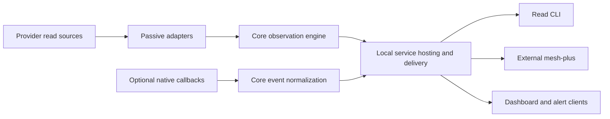

# Local state publication and native event observation

Date: 2026-10-09. Reviewed design checkpoint, not an implemented event API or
an accepted production event publisher. The [research plan](state-and-events-research-plan.md),
[independent evidence](evidence/2026-10-09-state-and-events-design/REPORT.md) and
[review](state-and-events-design-review.md) establish the decisions below.
The [execution plan](state-and-events-execution-plan.md) defines the following
implementation and acceptance gates. Existing API 2/read wire 4/Service 2 stay
accepted and unchanged.

**Scope refinement:** the user subsequently prioritized
[discovery/monitoring state push](state-push-design.md) and deferred native
occurrence-event normalization, callback emitters, event replay and desktop
notification integration. This document retains the preceding future-product
research; its proposed event product is neither implemented nor required by
current read clients. The [active plan](state-push-execution-plan.md) uses the
accepted complete-view state contract.

## Product and requirements authority

Observer provides two complementary read products:

1. **State:** which sessions are running or parked, and the current working,
   blocked or waiting phase, with independent evidence clocks and coverage.
   Cached pull and sampled push already deliver this reconciled view.
2. **Native events:** bounded facts that a supported source reported an
   occurrence, with exact identity, meaning, correlation and provenance.
   This is the new optional product. It does not promise a complete native
   history or infer occurrences from successive snapshots.

A fresh state snapshot restores the current view after a disconnection. It
cannot recover two completed turns between samples or reproduce missed alerts.
An event can be useful after its session disappears from discovery. Its receipt
does not establish the session's current runtime, phase, title or activity.

The [ESP32-349 handoff](notification-handoff.md) is **one client request**.
Its sender/title/static message, Kitty routing, child suppression and Open
preferences inform an alert client, not shared Observer policy. Clients can
retain children, choose different presentation, or consume only state. A device
can obtain state push without any completion callback or desktop integration.

| Consumer | Shared input | Consumer responsibility |
| --- | --- | --- |
| Read CLI / development inspector | State, event facts and delivery/source status | Inspect uncertainty, replay and identity; no desktop publication |
| Agent Plus | State first; events optional | Cache/presentation, urgency, context matching, actions and alert policy |
| RLCD / other dashboards | State push; optional supported event facts | Display urgency, stale/feed-loss behavior, device protocol |
| 349 notification request | Event facts plus optional state metadata | Sender/title/message, suppression, duplicate alerts, originating terminal, desktop/physical Open |
| Future client | Either read product | Its own subscriptions, formatting and delivery requirements |

Networking belongs to the separate **mesh-plus** repository/thread. Local
Observer delivery contains no SSH, remote host polling or session attachment.

## Ownership

- **Core:** state model/reconciliation, passive provider parsing, and pure event
  normalization/validation. Normalization strips content, preserves meaning and
  accepts explicit scope; it performs no provider query, I/O or alert decision.
- **Service:** source/helper lifetime, local callback intake, cached metadata
  enrichment, bounded event retention/fan-out and transport health. It already
  hosts authoritative state reads and refresh scheduling. Event delivery is a
  separate channel within that service, not a second observation daemon.
- **Read client:** pure event facade/parser/stream guard plus explicit CLI
  inspection. Reading never installs hooks, starts a provider or emits alerts.
- **External clients:** meshing, suppression, formatting, alert delivery,
  terminal/window context, attach/resume/new and Open. A context match never
  modifies Observer's native classification.

Three inputs remain distinct: internal refresh hints, public native event facts,
and user-facing notifications. A native callback may independently yield a
refresh hint and an event. The hint schedules a native query; only the query
supplies new runtime/phase/history evidence. Event receipts, queue heartbeats,
reader arrival and enrichment never renew state leases or conversation age.

## Required native sources and accepted study scope

Support binds source contracts and proved capabilities, not version allowlists.
The exact versions/hashes in the evidence identify these experiments only.

| Source | Initial meaning / use | Fresh proof and limits |
| --- | --- | --- |
| Codex passive daemon notifications | Refresh hints for authoritative state reads | Snap and Starship listeners saw thread/status events but no turn-completed event for two completed root turns each; not a passive full turn stream |
| Codex external `notify`, `agent-turn-complete` | `completion_notice`, with native thread/turn correlation | Both hosts' callbacks matched independently queried root thread/turn IDs; no general failure/interruption/headless/all-session delivery claim |
| Claude `PermissionRequest` | `attention_notice`, permission request observed | Snap interactive approval held without executing the tool; event precedes the delayed notification |
| Claude `Notification` | `attention_notice` for permission/elicitation; `idle_notice` for idle | Permission prompt proved on Snap, about six seconds after request; current idle/elicitation mappings need their own native acceptance |
| Claude `Stop` | `response_end_observed` | Two callbacks for one prompt with intervening continuation proved; no terminal outcome or successful task-completion claim |
| Claude `SubagentStop` | `response_end_observed` with subagent actor | Child callback carried parent session UUID plus actor ID; actor and logical session kind remain separate |
| Other callbacks / Codex hooks | Candidate future capabilities | Not selected by this design; distinguish documented candidates from fresh native proof |

Codex `thread/read` is read-only and does not subscribe. The installed daemon
schema exposes `thread/unsubscribe` but no passive `thread/subscribe`. The
documented detailed stream follows thread start/resume. Observer must not
resume/load/start threads to obtain that stream. A future passive native event
API can replace the callback source after independent proof; the current state
adapter remains authoritative meanwhile.

Claude interactive hooks work in this proof with Agent View and native alerts
disabled. Enabling Agent View or supporting background jobs is unnecessary for
this product. `PermissionRequest` is the early signal; delayed `Notification`
is a distinct native observation. The service publishes both if selected; a
client can coalesce related alerts. Neither callback settles current phase.

`Stop` can execute alongside another hook that continues work. Even a later
`Stop` is response-end evidence, not a universal final-success predicate.
Claude prompt IDs correlate one prompt; they do not identify unique approval,
question, idle or response-end events. `agent_type` alone does not prove a child.

Optional emitters must be neutral, finite and content-free on success and
failure: no decision fields, context injection or terminal output; exit zero
and `{}` for controlling hook interfaces. They only send bounded metadata to
the already-running local intake. No synchronous title/provider lookup, service
autostart, durable spool or mandatory hook dependency is included. A crashed or
missing emitter can lose events without observable evidence; declared source
coverage remains partial even when the intake is healthy.

## Proposed native event record

This is the implementation target for a separate **event wire 1**, not the
existing experimental notification wire 1. E0 must export concrete strict
schemas/validators and freeze the exact representation before source work.
It changes no state field or accepted read version.

| Field | Decision |
| --- | --- |
| `eventWire` | New event record discriminator, initially 1, in its own facade/schema namespace |
| `eventId` | Publisher-assigned opaque receipt UUID; immutable on replay; does not claim native exactly-once identity |
| `identity` | Existing full `hostScope/provider/namespace/nativeIdKind/nativeId` reference; configured scope plus exact native ID, never cwd/title/PID inference |
| `kind` | `completion_notice`, `response_end_observed`, `attention_notice`, or `idle_notice`; provider capabilities declare which are supported |
| `detail` | Finite source-specific meaning such as permission request versus permission notification; unknown meanings are not silently remapped |
| `source` | Adapter/callback kind, finite native event name, source epoch, provenance class and declared observation scope |
| `actor` | `session`, `subagent`, or `unknown`, plus nullable native actor ID; independent from the enclosing session's saved/discovery kind |
| `correlation` | Nullable native turn ID and prompt ID, retained only when their mapping is proved; no prompt/body/tool fields |
| `receivedAt`, `receivedBoottimeMs` | Host receipt clocks; original clock domain is bound by the delivery envelope; never conversation activity or native occurrence time |
| `metadata` | Nullable cached title and session kind, with finite availability/reason and nullable state service/view revision; enrichment context, not current state authority |

The first version does not add a generic successful/failed/interrupted outcome
to these notices. A separately supported terminal-outcome event would need its
own source predicate and review. In particular, Codex's two independently
completed test turns do not turn every callback into an independently queried
outcome. Claude Stop cannot fill this gap.

Configured callback origin and authenticated native daemon origin have distinct
provenance classes. Same-user IPC establishes permitted access, not cryptographic
provider authorship or action permission. The service binds namespace/source
scope to its selected intake configuration; callbacks cannot supply arbitrary
provider homes or select a different host. Invalid scope/identity is rejected
with content-free counters/status, never assigned to a guessed session.

The service enriches from its already accepted cache by full identity, without
delaying admission for a provider read. Missing titles remain null with a reason;
each client chooses fallback labels. Metadata source health and view revision
describe the lookup context and do not renew evidence. Published records remain
immutable: a later native rename can update state but cannot rewrite an old
event or manufacture a causal state revision.

Preserve child and unknown-actor facts in the shared feed. The Snap callback
study produced two additional Codex IDs whose current native detail was
unavailable. Their classification remains unknown; they are not declared
children by timing, absence, title or ID shape. A client chooses how to treat
unknowns. A child Stop under a parent UUID never reclassifies the parent row.

No record contains prompts, responses, hook captions, transcript paths, tool
arguments/output, credentials, OSC sequences, sender/body text, action tokens,
tmux/TTY/window handles, or a `notify/wake/ignore` disposition. Input parsers
reject duplicate keys, excessive depth/nodes, invalid encoding, nonfinite values
and invalid identifiers before constructing an allowlisted record.

## Identity, correlation and duplicate semantics

There are two independent identities:

- Receipt identity (`eventId`) is stable for an admitted record and its replay.
  Two invocations can legitimately create two receipts.
- Native correlation (full session scope, event meaning, actor and native turn
  ID where proved) lets a client recognize related notices. It is not a universal
  unique-event key. Claude prompt ID alone must never suppress later attention.

Repeated callbacks, multiple sources and later reconnection can expose related
receipts. Core preserves the source evidence rather than applying a global alert
deduplication policy. Clients may bound replay-ID suppression and coalesce
proved equivalent native completion notices. Missing correlation cannot be
replaced by a hash of content, title, timestamp or cwd. Host and namespace scope
must survive every downstream route.

## Local publication and replay

State continues on the existing Service 2 endpoint. Events use a distinct
proposed event protocol 1 and endpoint, hosted by the same service. Separating
envelopes avoids changing the state reconnect/lease semantics or implying that
watch resync repairs event loss. The pure event facade must import no service
hosting, provider/action, terminal or alert code.

The proposed read operations are `status` and `watch`. Requests select the
expected host scope, never stores, provider cadence, force-refresh or actions.
A watch must explicitly select one of these starting modes:

| Start | Behavior |
| --- | --- |
| live | Atomically bind the current high-water mark, then deliver later admissions |
| retained | Replay the currently retained suffix, clearly reporting that earlier history is unavailable, then follow live |
| after cursor | Replay strictly after an epoch/sequence cursor, or report a typed gap/restart/scope error |

No server-side consumer filtering is required initially. The read CLI may offer
filters, but its checkpoint advances to the scanned high-water mark, including
records it hides. Otherwise child filtering can replay the same invisible
suffix or falsely report no progress.

The event envelope binds publisher UUID/epoch, UID, host/source scope, kernel
boot and time namespace. A feed-global monotonic sequence orders **admissions**,
not native chronology; a separate per-connection frame sequence validates the
stream. Initial hello/replay barrier, event, checkpoint/heartbeat, source status,
gap and finite error frames have separate meanings. No heartbeat updates native
coverage, state leases or event time. Source epoch changes are explicit even if
the overall service/publisher remains alive.

Initial retention defaults are **256 records, 1 MiB total encoded bytes and
five minutes BOOTTIME**, with a 16 KiB record ceiling. These are bounded starting
choices, not an accepted performance or client-history budget. Evict by oldest
admission under any limit. Retain the loss floor when all entries expire. Restart
changes publisher epoch; equal numeric sequence positions from another epoch
are invalid. Limits are reported in status/hello and never inferred by clients.

Replay and live admission have one atomic high-water boundary. A subscriber
replays through that boundary and then receives later sequences exactly once
within that connection, barring an explicit delivery gap/disconnection. Retain
stable event IDs on replay. No durable journal or cross-restart native replay is
promised. A client wanting a long notification history must own persistence or
bring that requirement to a separate review.

Slow readers cannot expand producer memory or stall provider/state work. A
bounded subscriber falls behind with a typed delivery gap and resumable retained
cursor, or is disconnected if even control delivery is blocked. A cursor older
than retention reports loss before live continuation. It never silently skips
to a fresh snapshot and claims that native events were recovered.

Intake parsing, worker/output queues and records must be bounded independently
from replay. Detectable rejected/lost supported inputs update source status and
input-loss counters; a rejected input consumes no published record sequence.
The publisher must not label admitted-record continuity as native completeness.
Unsupported event types are a capability limit, not synthetic completions.

## Source health and failure domains

Event status reports configured sources/capabilities, scope, source epoch,
intake readiness, last accepted receipt and finite rejected/detected-loss
counters. It distinguishes disabled, ready, degraded and unavailable intake.
Ready means this receiver can accept input; it does not mean hooks are installed
in every current session or prove no native callback was missed.

Keep three limitations separate:

1. **Native observation coverage:** optional callbacks and documented topology
   limits; some losses are undetectable. Do not report an exhaustive census.
2. **Detectable source/intake loss:** helper restart, malformed/oversized supported
   input, intake overflow or unavailable endpoint. Publish finite status/gap
   evidence where observable; recovery does not recreate missing occurrences.
3. **Observer delivery loss:** retention expiry, slow reader, publisher restart
   or transport interruption. Epoch/cursor protocol describes its own bounds.

Event source failure leaves accepted state collection running. State faults do
not suppress an independently admitted event, but invalidate cache enrichment
where appropriate. No event intake path may synchronously query a provider.
Reuse existing owned hint listeners where safe; adding event readers must not
multiply native clients/helpers or trigger provider work per subscription.

Local clocks remain host-local. mesh-plus must preserve original identity,
publisher/source epochs, receipt clocks, capabilities and gap evidence, with its
own authenticated host route and conservative age handling. It cannot compare
raw BOOTTIME across hosts or change a remote session to parked after network loss.

## Decisions and following gates

The two-product model, ownership, event meanings, optional-source coverage,
full identity, immutable metadata context, receipt/correlation distinction and
bounded replay failure semantics are settled by this design review. Exact JSON
schemas, SDK names, endpoint path and CLI syntax are frozen at E0 before
implementation; they are not presented as installed commands today.

The [execution plan](state-and-events-execution-plan.md) gates pure contract,
source adapters/neutral emitters, service delivery, read CLI, immutable native
acceptance and scoped operations separately. A desktop alert client and its
349/Kitty request have a later independent gate. No accepted state contract,
ordinary provider policy, hooks, managed selection or downstream frontend is
changed by this checkpoint.

## Primary references

- [Codex App Server](https://learn.chatgpt.com/docs/app-server): read/subscription and notification semantics.
- [Codex external notifications](https://learn.chatgpt.com/docs/config-file/config-advanced#notify-vs-tuinotifications): external callback versus TUI notification settings.
- [Codex hooks](https://learn.chatgpt.com/docs/hooks): candidate callback and controlling-hook semantics; not fresh native acceptance here.
- [Claude hook reference](https://code.claude.com/docs/en/hooks): Stop continuation, actor/prompt correlation, permission and delayed notification semantics.

Documentation informs the hypothesis. The linked native report establishes the
installed source observations and preserves unproved capabilities explicitly.
